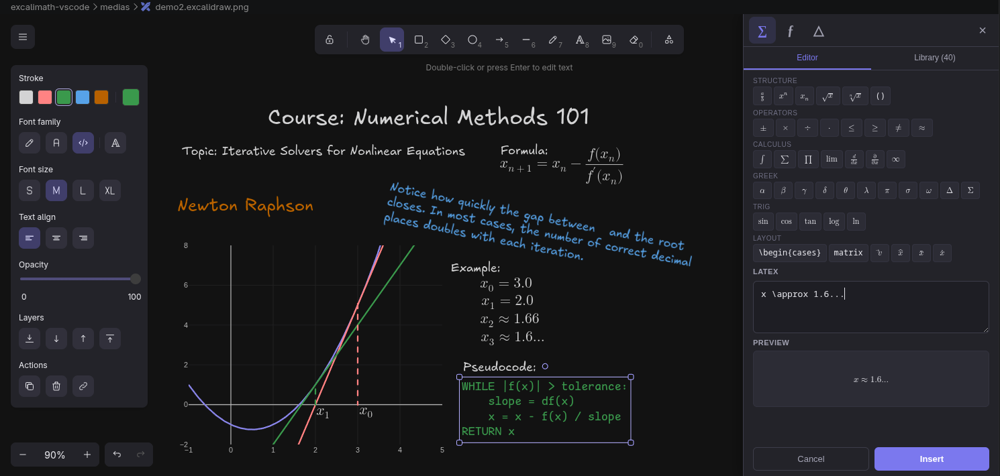
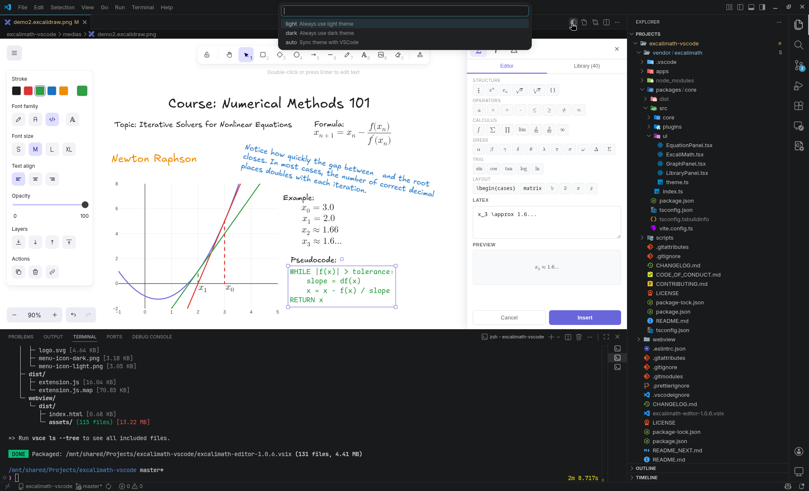
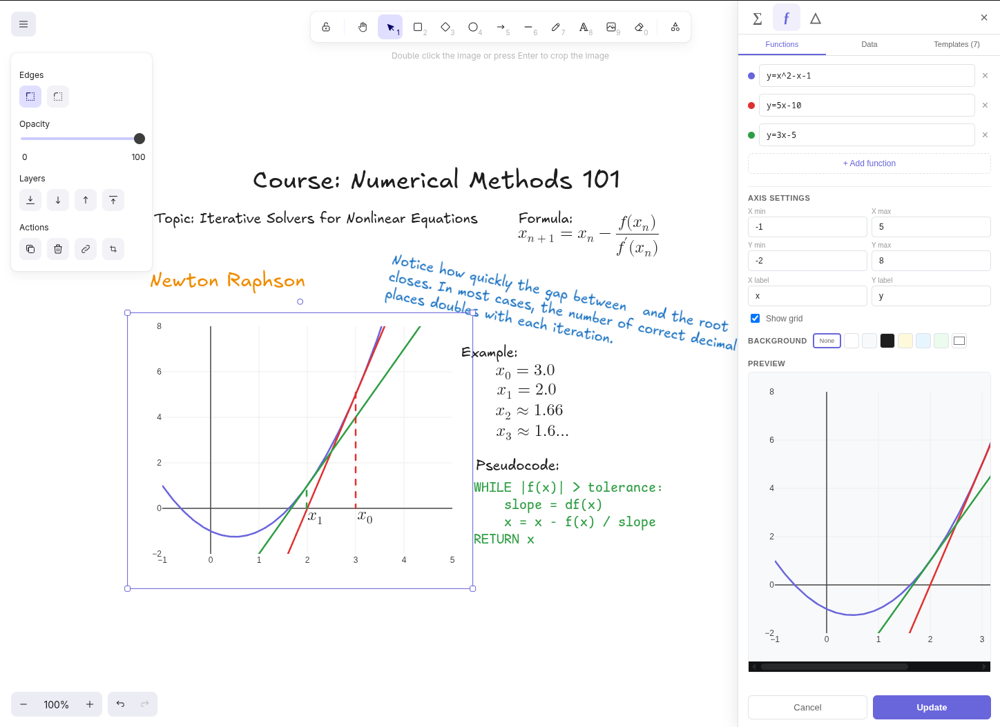
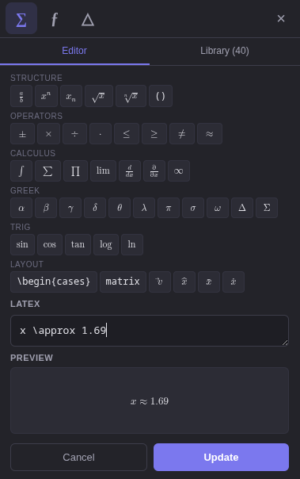
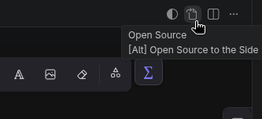

# ExcaliMath for VS Code

Turn VS Code into your math diagram studio.

ExcaliMath brings Excalidraw and advanced math workflows directly into Visual Studio Code, so you can create and edit equations, plots, and technical visuals without leaving your editor.

Create or open files with one of these extensions:

- `.excalidraw`
- `.excalidraw.svg`
- `.excalidraw.png`
- `.excalidraw.json`

Try the web version: <https://excalimath.my-lab.ro/> (fully Excalidraw compatible).



## Why install

- Faster math diagrams for notes, docs, lectures, and technical reports
- Native Excalidraw compatibility across web and VS Code workflows
- Editable `.png` and `.svg` with embedded source
- One-tool pipeline for draw, refine, and export

## Showcase

### Switch theme quickly



### Plot equations



### Update equations fast



## Key features

### Edit images directly

Rename file extension to change export/source format, for example:

- `document.excalidraw` -> `document.excalidraw.png`
- `document.excalidraw` -> `document.excalidraw.svg`

Configure image export defaults:

```json
{
  "excalimath.image": {
    "exportScale": 1,
    "exportWithBackground": true,
    "exportWithDarkMode": false
  }
}
```

### Draw from browser-based VS Code

Install and use the extension in:

- [github.dev](https://github.dev)
- [vscode.dev](https://vscode.dev)

Great for editing diagrams directly from GitHub repositories.

### Import public libraries

Use reusable community assets from [libraries.excalidraw.com](https://libraries.excalidraw.com).

### View and edit drawing source

Switch between visual editor and file source (text/image) using the editor toolbar.



### Associate more file extensions

By default, the extension handles:

- `*.excalidraw`
- `*.excalidraw.svg`
- `*.excalidraw.png`

To associate more extensions (example: all SVG files), add:

```json
{
  "workbench.editorAssociations": {
    "*.svg": "editor.excalimath"
  }
}
```

Note: only Excalidraw/ExcaliMath-compatible SVG content is editable.

### Share a workspace library

Set a workspace library path in `.vscode/settings.json`:

```json
{
  "excalimath.workspaceLibraryPath": "path/to/library.excalidrawlib"
}
```

The path is relative to workspace root (absolute paths also work, but are machine-specific).

### Configure language

By default, extension language follows VS Code display language.
Override with:

```json
{
  "excalimath.language": "fr-FR"
}
```

## Contact

Report VS Code integration bugs and feature requests in this repository.

For core editor behavior unrelated to VS Code integration, use the ExcaliMath or Excalidraw project trackers.

## Note for contributors

The extension goal is a smooth, low-friction bridge between ExcaliMath web and VS Code.

Contributions that significantly diverge from the core ExcaliMath/Excalidraw user experience are generally out of scope, except for VS Code-specific integration improvements.

If unsure, start a discussion: <https://github.com/DynoW/excalimath-vscode/discussions>
